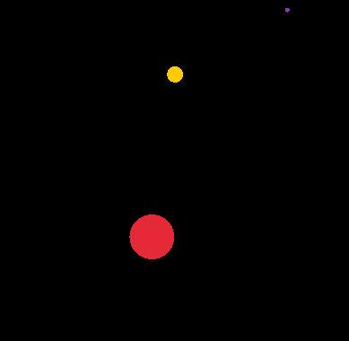
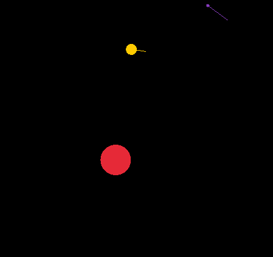
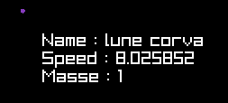
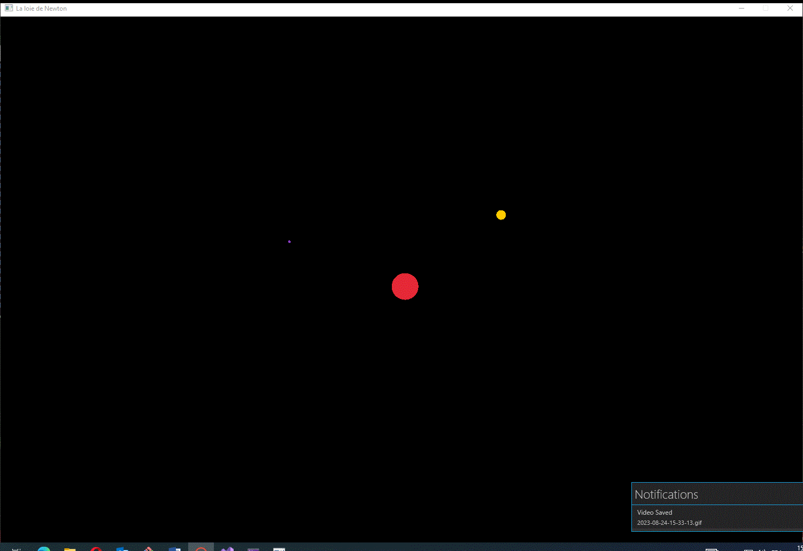
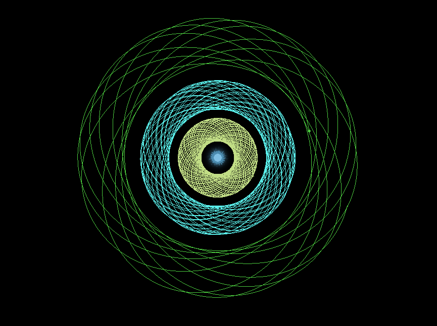
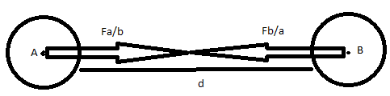

# Projet des orbites

## Prérequis et Nécessaire

#### Matériel et logiciel 

* Un éditeur de texte
* Un clavier et une souri 

#### Librairie 

* Raylib 
```powershell
	dotnet add package Raylib
```

## But

Le but de se projet est de développé une simulation paramétrer de la gravitation universelle. Ceci se base sur le fait que dans l'espace sans frottement et sans autre réaction, il s'agit de la seul chose qui influence la trajectoire des planètes. Le projet sera fait en 2D mais une implémentation en 3D est totalement possible. L'idée serait de permettre à l'utilisateur de créer son propre "système solaire" en observant puis modifiant les différents paramètre qui gère les mouvements des corps (masse, vitesse, position). Le but étant de créer des orbites stables. 

## Interface graphique
Sur mon interface les corps seront de simple boule de couleur qui bouge en fonction d'une vitesse initial et l'attraction au autre corps :



* Si l'on presse V l'interface nous les vecteurs vitesse associé à chaque corps :
 


* Si l'on click sur une planète on obtiens des informations complémentaire sur elle :



* Si l'on presse sur A après avoir clicker sur un astre et l'on sera dans son référentielle :



* Les nouveaux ajoute à faire l'interface une fois les bases physiques posé sont de données le contrôle à l'utilisateur sur la simulation et ces paramètres modifiables. Il est maintenant possible de contrôlé le temps, de créer et modéler de nouvelles planète et de les déplacer à ça guisse. 


* Les tarjectoire anticiper peuvent activé ou désactivé avec N et ressemble a ceci :



## Théorie Physique

### Trouver le déplacement d'un corp

<br>

Ici nous avons un bonne exemple avec deux corp en attraction. Les flèches montrent les vecteurs force. Ces deux vecteur ont une norme identique, c'est à dire les grandeurs de ceci sont les mêmes. De plus l'on remarque que le sens de ces vecteurs est opposé. *d* indique la distance qui sépare nos astres et Ma, Mb sont les masses de nos corps.

  

#### Trouver la force d'attraction en fonction de la gravitation universelle

Avec toute ces informations il est possible de calculé la force d'attraction des corps selon cette équation :

$F\tiny{ab} = G*\frac{M\tiny{a} * M\tiny{b}}{d^2}$

G la constante gravitationnelle à été placé à 1 (dans le cadre de la simulation) donc l'influe pas sur l'équation.

  

#### Trouver l'accélération en fonction de la force d'attraction

Il existe un lien direct entre la force et l'accélération et il s'agit de l'équation :

$\vec{F\tiny{ab}}=M\tiny{a}*\vec{a}$

Mais le problème est que l'équation de la gravitation noté plus haut, donne la magnitude de ce vecteur et n'en est pas un. Ce qui veux dire que allons devoir trouver le vecteur force avant. Heureusement cet opération est assez haïssez car il suffit de faire le produit scalaire de la magnitude et d'un vecteur de valeur (1,1). Une fois *→F* obtenu, nous réarrangeons l'équation de l'accélération pour l'isoler ce qui nous donne :

$\vec{a}=\frac{\vec{F\tiny{ab}}}{M\tiny{a}}$

#### Trouver la vitesse en fonction de l'accélération

La vitesse est obtenu en faisant de la cinétique :

$\vec{v\tiny{1}}=\vec{v\tiny{0}}+\vec{a}*\Delta t$

Comme Δt vaut toujours 1 (décidé ainsi car la mesure de la gravité est fait à des temps similaire et régulier pour tout les corps).

Se qui nous laisse avec : 

$\vec{v\tiny{1}}=\vec{v\tiny{0}}+\vec{a}$  

Cet équation nous informe que avec les conditions cité au dessus, la vitesse est égal à la vitesse précédente + l'accélération.

### Conséquence

#### Inertie
Si l'on reprends la formule $\vec{v\tiny{1}}=\vec{v\tiny{0}}+\vec{a}$*V1 = V0 + →a* l'on remarquera que si la vitesse est nulle au départ les corp ne pourront que s'écraser l'un dans l'autre. Il sera donc nécessaire pour obtenir une belle simulation de donner une vitesse initial à nos corps.

#### Vitesse de la lumière
La vitesse de libération d'un corp, est la vitesse qu'il doit atteindre pour pouvoir se libérer de l'attraction d'un autre corp plus massif, par exemple sur terre celle-ci est de 11km/s se qui veux dire qu'une fusée qui veux pouvoir quitté la terre doit atteindre cet vitesse au minimum. Ici dans cet simulation les objects n'ont pas de vitesse maximum atténiable, alors que dans la réalité rien ne peux se déplacé plus vite que la lumière(même pas la lumière elle même). Se qui implique que la création d'un troue noir dans la simulation est impossible car se qui fait qu'un troue noir est se qu'il est, c'est que l'énergie de libération neccessaire à s'en échapper est supérieur à la vitesse de la lumière donc même la lumière ne peux pas s'en échapper.
